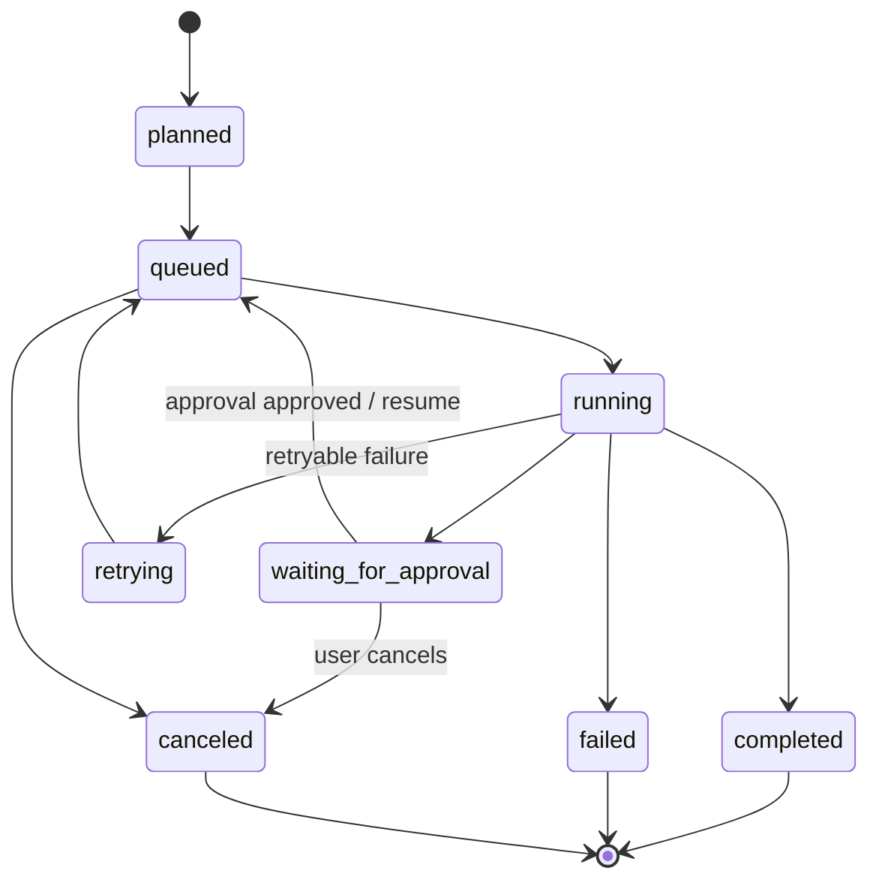
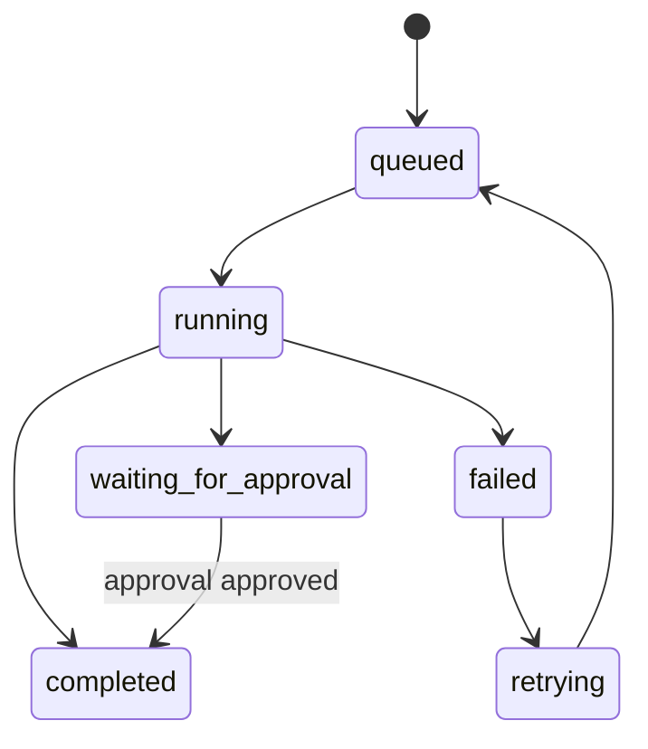
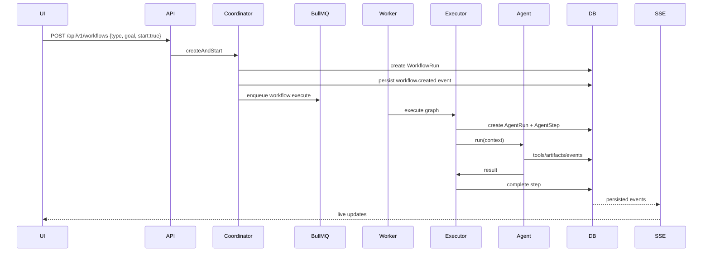
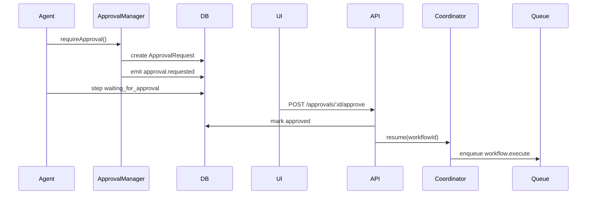

# Autonomous AI Orchestration Engine

Date: 2026-05-08

This is the production architecture for the AI Career OS orchestration layer. It is intentionally modeled after durable workflow systems such as Temporal, agent graph runtimes such as LangGraph, and operator-style AI systems with human checkpoints.

## 1. Core Architecture

### Folder Structure

```text
lib/orchestration/
  types.ts                 # canonical workflow, agent, event, retry, tool types
  workflow-definitions.ts  # DAG definitions for career workflows
  coordinator.ts           # create/start/resume/cancel entrypoint
  executor.ts              # durable DAG executor
  state-manager.ts         # DB state transitions
  events.ts                # persistent event bus + local emitter
  queue.ts                 # BullMQ orchestration queues
  base-agent.ts            # BaseAgent abstract class
  agent-registry.ts        # typed registry
  agents.ts                # built-in career agents
  tools.ts                 # tool registry and default tools
  memory.ts                # memory retrieval and compression
  model-router.ts          # model routing, token/cost tracking
  observability.ts         # OpenTelemetry spans and metrics
workers/
  orchestration-worker.ts  # queue consumer for workflow.execute
app/api/v1/workflows/
  route.ts                 # create/list, supports start=true
  [id]/execute/route.ts    # enqueue existing workflow
  [id]/resume/route.ts     # resume paused workflow
  [id]/cancel/route.ts     # cancel workflow
  [id]/events/route.ts     # SSE event stream
components/agents/
  WorkflowVisualizer.tsx   # real-time workflow timeline
hooks/useWorkflowEvents.ts # SSE subscription
store/useWorkflowStore.ts  # live event state
```

### Service Boundaries

| Boundary | Responsibility |
|---|---|
| Coordinator | Authenticated lifecycle commands: create, start, resume, cancel |
| Executor | Runs DAG steps deterministically from DB state |
| State Manager | Owns WorkflowRun, AgentRun, AgentStep transitions |
| Event Bus | Persists WorkflowEvent records and streams local subscribers |
| Agent Runtime | BaseAgent, registry, tool calling, structured outputs |
| Approval Manager | Creates ApprovalRequest and pauses workflow |
| Memory Retriever | Retrieves/ranks CareerMemory for each agent intent |
| Queue Layer | BullMQ durable scheduling and retry |
| Worker | Executes queued workflow jobs outside the web request |

## 2. Workflow State Machine



Step state:



## 3. Queue Topology

| Queue | Purpose | Concurrency | Retry |
|---|---|---:|---|
| `career-os-workflow` | DAG execution and non-browser agent work | 5-50 | 3 attempts exponential |
| `career-os-browser` | Playwright/browser tasks | source-specific | conservative |
| `career-os-telemetry` | async analytics and event exports | high | best effort |
| `career-os-workflow-dlq` | dead letter inspection | manual | none |

Redis strategy:

- BullMQ queues use TCP Redis via existing `getQueueRedisConnection`.
- Workflow jobs use deterministic job ids: `workflow:{workflowId}:{stepId|graph}:{traceId}`.
- Future distributed locks should use `workflow-lock:{workflowId}` with short TTL to prevent duplicate graph execution.
- Redis Streams can replace the local event emitter for multi-instance SSE fanout.

## 4. DB Persistence Strategy

| Table | Role |
|---|---|
| `WorkflowRun` | durable workflow state and graph metadata |
| `AgentRun` | one agent execution attempt |
| `AgentStep` | one durable step record |
| `ApprovalRequest` | human checkpoint state |
| `WorkflowEvent` | replayable event log for UI, debugging, recovery |
| `CareerMemory` | long-term personalization context |
| `ApplicationArtifact` | generated packets, diffs, drafts |
| `AIUsage` | model cost and token accounting |
| `AuditEvent` | security and compliance audit trail |

## 5. Execution Flow



## 6. Approval Pause/Resume



## 7. Memory Orchestration

Pipeline:

1. Convert workflow type to retrieval intent.
2. Pull typed memories relevant to intent.
3. Rank by type boost, lexical score, confidence, and recency.
4. Compress to a token budget.
5. Inject into AgentContext.

Future improvements:

- pgvector or Qdrant embeddings.
- hybrid retrieval: SQL filters + vector search + reranker.
- memory promotion rules from outcomes.
- context pack caching by `(userId, workflowType, stepId, memoryVersion)`.

## 8. Failure Handling

Failure categories:

- transient_network.
- provider_rate_limit.
- model_overloaded.
- tool_timeout.
- browser_brittle.
- approval_expired.
- policy_blocked.
- invalid_input.
- security_violation.
- unknown.

Retry policy:

- retry only retryable categories.
- exponential backoff with jitter.
- no retries on policy/security/invalid input.
- terminal failures emit `workflow.failed`.
- unrecoverable jobs are copied to `career-os-workflow-dlq`.

Partial recovery:

- completed steps are not rerun unless `replay=true`.
- failed steps can be replayed by step id.
- pending approvals pause the graph.
- approval approval resumes from the next uncompleted step.

## 9. Cost Optimization

Current implementation:

- model tier routing by workflow and task.
- prompt pruning by token budget.
- AIUsage persistence.
- estimated token/cost accounting.
- cheap tools before expensive model calls.

Future:

- content-hash prompt cache.
- embedding cache by normalized text hash.
- batch job-ranking.
- premium model only for planner and final user-facing artifacts.
- deterministic policy checks outside LLMs.

## 10. Observability

Implemented:

- OpenTelemetry span wrapper in `traceWorkflow`.
- structured metrics for workflow duration, model latency, memory retrieval.
- persistent `WorkflowEvent` log.
- existing Sentry/OpenTelemetry can ingest worker traces.

Dashboards:

- workflow success rate by type.
- step failure rate by agent.
- approval latency.
- retry rate by failure category.
- cost per completed workflow.
- token usage by task.
- DLQ count and age.

## 11. Security

Controls:

- all routes require authenticated user.
- every DB read/write is scoped by `userId`.
- external actions require ApprovalRequest.
- workflow events have visibility levels.
- tools declare permissions.
- secret-like keys are stripped from user-visible artifacts.
- browser work must run in isolated workers, not the web process.

Future:

- policy engine for tool permissions.
- KMS-encrypted credentials.
- browser containers per user.
- prompt injection classifier for job pages and recruiter messages.
- PII redaction for logs and traces.

## 12. Scale Architecture

For 1M users and 100k concurrent workflows:

- shard workflow queues by user hash: `career-os-workflow:{shard}`.
- run workers in Kubernetes with HPA by queue depth and latency.
- separate browser node pool with memory-based autoscaling.
- move event fanout from local EventEmitter to Redis Streams, NATS, or Kafka.
- partition WorkflowEvent by month or workflow id.
- store long browser traces in object storage, not Postgres.
- use distributed locks for one active executor per workflow.
- use read replicas for dashboard/event history.
- enforce per-user, per-plan, per-source rate limits.

Queue partitioning:

```text
workflow shard = hash(userId) % 128
browser shard = hash(sourceHost) % 64
telemetry shard = hash(eventType) % 16
```

## 13. Key Decisions

1. Use Postgres as the source of truth for workflow state.
2. Use BullMQ for execution scheduling now; move to Temporal only when workflow complexity demands it.
3. Use explicit DAG definitions instead of LLM-managed control flow.
4. Treat approvals as durable state, not UI modals.
5. Persist all workflow events for replay and debugging.
6. Keep browser automation in a separate queue and worker class.

## 14. Risks and Debt

Biggest scalability risks:

- local EventEmitter does not fan out across app instances.
- long SSE connections on serverless infrastructure may need a realtime gateway.
- one queue can become hot without sharding.
- browser automation will dominate compute cost and support load.

Most dangerous technical debt:

- letting LLMs decide external actions without policy gates.
- treating workflow events as logs instead of replayable state.
- not linking failures to categories.
- not tracking model cost per workflow.
- storing browser traces or secrets carelessly.

Do not overengineer initially:

- custom graph database.
- custom vector infrastructure before memory retrieval is used heavily.
- full Temporal migration.
- multi-region active-active.
- browser autopilot across every ATS.
- complex ML ranking.

MVP order:

1. Durable workflow graph execution.
2. Approval pause/resume.
3. Event streaming UI.
4. Memory retrieval and context packs.
5. Resume optimization workflow.
6. Job matching workflow.
7. Auto-apply co-pilot with one ATS.
8. Recruiter outreach workflow.
9. Failure dashboards and DLQ tooling.
10. Queue sharding and browser isolation.

