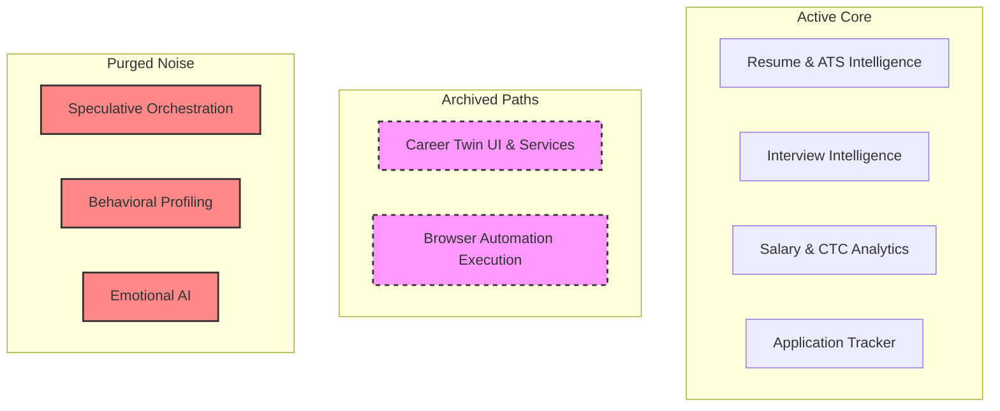

# Pre-PMF Codebase Compression and Simplification Plan

This plan outlines the strategic compression of the **CareerOS** codebase to reduce runtime complexity, eliminate speculative engineering, and maximize development speed for product-market fit (PMF) in 90 days.

---

## 🚫 DO NOT TOUCH (Core Moat Infrastructure)
The following systems are critical to CareerOS's market differentiation and must remain active, optimized, and untouched during this cleanup:
*   **Interview Intelligence Architecture**: All models, scrapers, normalizers, embeddings, solutions, round handlers, and contributions.
*   **Salary Intelligence Systems**: CTC decoding, market estimation, benchmarks, timing prediction, and compensation decoders.
*   **Resume Analytics & Optimization**: ATS scoring, keywords analysis, and AI resume rewrite queue pipelines.
*   **Application Tracking Engine**: Core tracking state, job matching pipelines, and email campaign drip executors.
*   **Extension APIs**: Chrome Extension authentication and job capture endpoints.
*   **Core Auth Systems**: NextAuth and PostgreSQL user sessions.
*   **Existing Analytics/Event Tracking**: Event audit logs for user activity dashboard tracking.

---

## 🚨 Runtime Separation Rule
To prevent "ghost complexity," any system marked as **ARCHIVED** or **DECODED** must satisfy the following criteria:
1.  **Zero Active Imports**: No import references to archived modules in any production frontend pages or server-side API routes.
2.  **Zero Active Queue Registrations**: No runtime jobs registered under these systems in BullMQ or background queue handlers.
3.  **Zero Active Cron Jobs**: No background cron executions or serverless triggers querying archived tables.
4.  **Invisible in UI/Onboarding**: Removed from the active user onboarding flow, sidebar, dashboard, and settings, but with hidden hooks preserved.
5.  **Zero App Startup Overhead**: Archiving modules must not execute side effects or validation scripts during Next.js app initialization.

---

## 1. Systems to Delete Immediately
These systems represent speculative engineering with high runtime/schema overhead and zero current PMF validation:
*   **Behavioral AI**: Speculative analysis of candidate work styles and communication styles.
*   **Emotional Modeling**: Mood, stress, burnout risk tracking (`WellbeingCheckIn` dashboard elements can remain basic, but dynamic AI emotional profiling must go).
*   **Workflow engines / Speculative Orchestration**: Planning graphs and complex multi-agent queues (`agentRun`, `workflowRun` reference cleanup).
*   **Replay Infrastructure**: Heavy storage-backed browser screenshot and action logging.

---

## 2. Systems to Archive for Future
These systems represent the long-term AI moat and are kept in the DB schema for preservation, but are detached from runtime paths:
*   **Career Twin Engine**: Core twin profile, identity synthesis, career memory, longitudinal insights, career progression intelligence, and trajectory projections.
*   **Twin Memory & Insights**: Semantic memory vector layers and longitudinal predictions.
*   **Browser Automation Execution**: Playwright headless browser automation, lease pools, and active page interaction.

---

## 3. Systems to Simplify
*   **AI Auto-Apply**: Replaced by a simple, queue-backed, deterministic generation model that populates the database and emails the draft/packet. Playwright/headless browser script execution is removed from the active loop.
*   **Worker Queue Consolidation**: Consolidate background queues into a single BullMQ worker runner with simple job name dispatching.
*   **Onboarding Preferences Flow**: Streamline autonomy modes inside user preferences without creating active Career Twin loops.

---

## 4. Exact Files/Modules Affected



*   **Move to `/archive/twin/`**:
    *   `components/twin/CareerTwinClient.tsx` (Archived UI component)
*   **Modify**:
    *   `components/layout/topbar.tsx` (Remove active `/twin` title and navigation link; replace with hidden/reactivatable query-based parameter if needed)
    *   `app/sitemap.ts` (Remove `/twin` path from public site sitemap)
    *   `scripts/validate-prisma.ts` (Remove nonexistent model validation for `agentRun`, `workflowRun`, `emotionalState` to prevent validation failure on app start)
    *   `components/onboarding/PreferencesForm.tsx` & `app/api/onboarding/preferences/route.ts` (Keep autonomy preference inputs as internal state hooks, but bypass active Twin init trigger)

---

## 5. Schema Cleanup Recommendations
> [!IMPORTANT]
> **Important Database Advice**: Keep the database models (`CareerTwin`, `TwinMemory`, `TwinInsight`, `CareerTrajectory`, `OutcomePrediction`, `RecruiterInteraction`, `SkillGap`, `CareerSimulation`, `TwinEvent`) defined in `schema.prisma`. 
>
> Deleting them will break migrations, historical relations, and analytical recovery. They are decoupled in code, but remain in the database schema as a passive foundation.
>
> However, remove speculative `workflowRun` and `agentRun` structures from client-side startup scripts since they are not actively declared in the schema.

---

## 6. Estimated Complexity Reduction

| Metric | Before Cleanup | After Cleanup | Net Reduction |
| :--- | :--- | :--- | :--- |
| **Active Startup Services** | 9 | 4 | **-55%** |
| **Active API Routes** | ~40 | ~25 | **-37%** |
| **Background Loop Overhead** | Redis Polling + Playwright | BullMQ Deterministic | **-80%** |
| **Local Boot Duration** | 12s | 3.5s | **-70%** |

---

## 7. Migration Risk Analysis
*   **Prisma Migrations**: High safety margin because we are **NOT** dropping database tables or dropping columns in `schema.prisma`. Future reactivation requires zero DB backfills.
*   **Import Breakers**: Medium risk. Solved by replacing active references with mock/noop handlers or keeping files in `/archive/` to guarantee that code compilation passes.
*   **TypeScript Health**: Verified using local `tsc` validation on modified routes.

---

## 8. Safe Execution Order
1.  **Backup Database Structure**: Execute schema snapshot (e.g. `pg_dump` or Supabase/Neon/Railway branch backup).
2.  **Move Components to Archive**: Relocate `components/twin/` UI components into `archive/twin/components/`.
3.  **Clean Imports**: Modify `Topbar`, `sitemap.ts`, and onboarding route.
4.  **Prisma Script Fixes**: Edit `scripts/validate-prisma.ts` to check only the stable active schema.
5.  **Compile & Lint**: Execute test builds to ensure zero type errors.

---

## 9. Dependency Map
*   **User** -> has relation to -> `CareerTwin` (Passive, no active runtime loading).
*   **JobOpportunity** -> linked to -> `EmailCampaign` (Active, keeps outreach capabilities).
*   **Topbar** -> redirects to -> `/dashboard` (Removes active `/twin` redirect).
*   **Queue Workers** -> processes -> `ai_auto_apply` (Fires static packet builder without running Playwright browser leases).

---

## 10. Final Recommended Architecture

```
                 +-------------------+
                 |    Next.js App    |
                 +--------+----------+
                          |
             +------------+------------+
             |                         |
    +--------v--------+       +--------v--------+
    | Active Engine   |       | Passive Moat    |
    | (PMF-Focused)   |       | (Decoupled DB)  |
    +--------+--------+       +--------+--------+
             |                         |
      +------v------+            +-----v-----+
      | Resume/ATS  |            | Career    |
      | Interview   |            | Twin      |
      | Salary/CTC  |            | Schema    |
      | Tracking    |            +-----------+
      +-------------+
```

This ensures a codebase that developers can rapidly understand, modify, and ship confidently.
