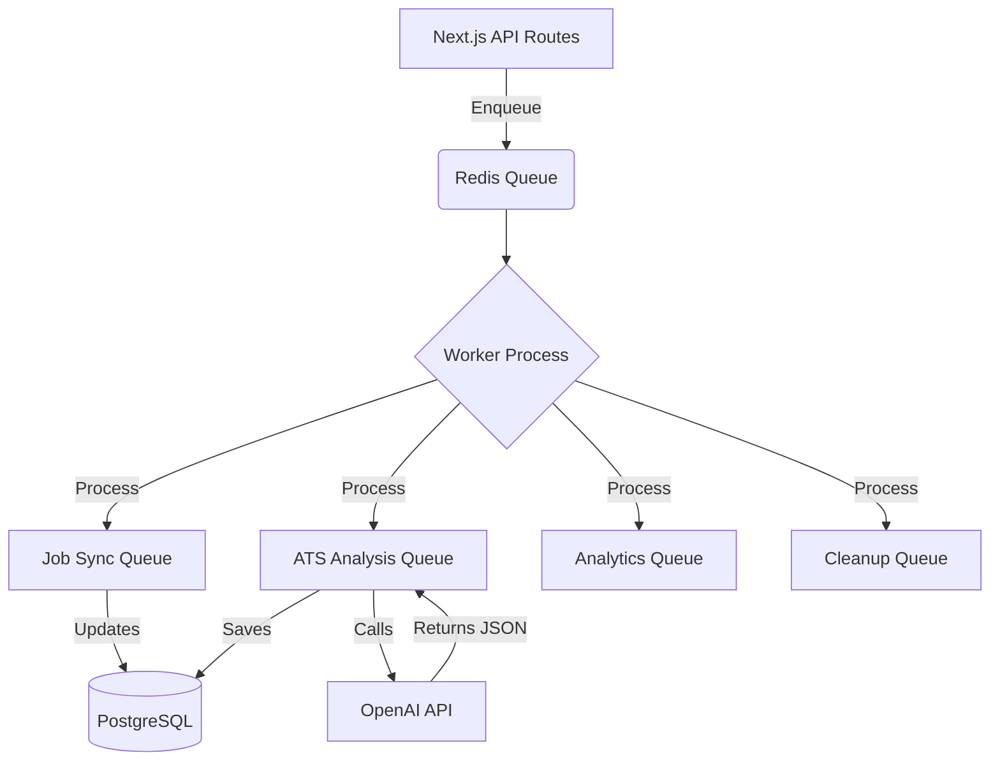
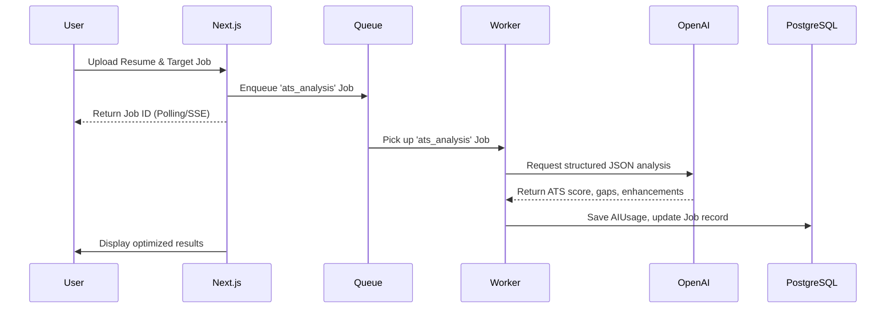
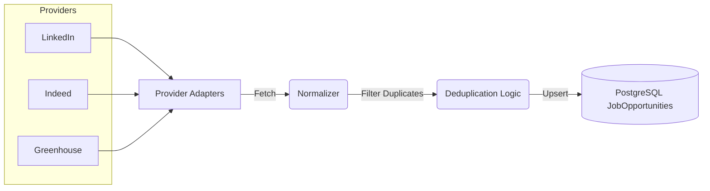

# System Architecture Overview

This directory contains the core architectural diagrams and documentation for the production-ready AI Resume Builder & Job Intelligence SaaS.

## Queue Flow (BullMQ + Redis)

## ATS Analysis Pipeline

## Job Ingestion Flow

