# AI Career OS Master Plan

Date: 2026-05-08

Repo context: Next.js 16, React 19, TypeScript, Prisma, PostgreSQL, BullMQ, Redis, NextAuth, Tailwind, OpenTelemetry, Sentry, existing AI integrations, resume builder, ATS analyzer, cover letter generator, job intelligence, analytics dashboard, and auto-apply prototype.

Competitor source note: Tailorec's public beta page currently positions itself around personalized job matching, transparent fit scores, verified listings, AI resume tailoring, one-click apply, and referral access: https://www.beta.tailorec.com/. This document treats that as the visible baseline, then designs a more advanced operating system for job seekers.

## Section 1 - Product Vision

### Company Vision

Build the autonomous career operating system that helps every ambitious professional find, win, negotiate, and grow into better work.

The product is not a resume tool. It is an AI execution layer for career mobility: a system that understands the user, scans the market continuously, plans a career strategy, runs job-search workflows, coordinates documents and outreach, learns from outcomes, and compounds every interaction into a personal advantage.

### 10-Year Mission

In 10 years, the platform should become the default career command center for knowledge workers and high-skill labor markets:

1. Own the candidate-side system of record for career identity, goals, evidence, applications, interviews, offers, compensation, referrals, and professional relationships.
2. Replace reactive job searching with autonomous opportunity discovery and execution.
3. Build the largest outcome-labeled dataset connecting candidate attributes, job descriptions, recruiter behavior, application artifacts, interview performance, and offer outcomes.
4. Make career movement measurable: users should know which skills, stories, companies, channels, and referrals increase their probability of success.
5. Become the trusted AI representative that can act for a user across job boards, company ATS systems, email, networking platforms, interview prep, and negotiation.

### Product Thesis

The winning career AI company will not be the one that writes the cleanest resume. It will be the one that owns the closed loop:

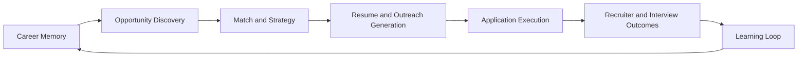

Resume generation is a feature. Outcome learning is the company.

### Why Current Resume Builders Are Weak

Most resume builders optimize a static document. They fail because:

| Weakness | Why It Matters | Strategic Opening |
|---|---|---|
| Static profile | A user's positioning changes by role, company, seniority, geography, and market cycle | Build dynamic career identity, not a document |
| No outcome loop | They do not know which resume, story, channel, or recruiter produced interviews | Learn from real application results |
| No market model | They cannot reason about hiring urgency, company quality, competition, or salary | Build a job intelligence graph |
| No execution | Users still search, filter, apply, follow up, and track manually | Create agents that act |
| Shallow personalization | Most systems only parse resume text and job descriptions | Build persistent memory from behavior, preferences, and outcomes |
| No network layer | Referrals are decisive but invisible | Build relationship and referral intelligence |
| No trust controls | Automation without approval feels risky | Build transparent autonomy with human checkpoints |

### Why Tailorec Is Still Incomplete

Tailorec's public workflow is directionally right: personalized feed, fit score, verified listings, AI resume tailoring, one-click apply, and referral access. The gap is that this still looks like an intelligent job portal, not a full operating system.

Missing layers to beat it:

| Tailorec-Like Layer | Required Next Layer |
|---|---|
| Personalized feed | Autonomous market scanner with daily agent plans |
| Fit score | Outcome-calibrated probability model |
| Verified jobs | Hiring urgency, ghost job risk, company quality, recruiter activity |
| AI resume tailor | Variant testing, success memory, evidence-aware rewriting |
| One-click apply | DOM-aware browser agent with audit trail and approvals |
| Referral access | Multi-hop social graph, warm intro drafts, timing optimization |
| Career companion | Career OS with persistent memory, workflows, and learning loops |

### Future of AI Job Seeking

The future user experience:

1. The user states a career goal once: "Senior product designer, remote or NYC hybrid, AI tools, $180k+, no crypto, prefer design-led companies."
2. The system builds a living career memory: skills, proof points, writing style, values, target compensation, constraints, weaknesses, and preferred risk level.
3. Autonomous agents continuously discover jobs, rank opportunities, detect referrals, generate application strategy, tailor documents, and queue actions.
4. The user approves sensitive actions in a command center instead of doing repetitive work.
5. The system learns from recruiter opens, responses, interviews, rejections, offer stages, compensation, and user edits.
6. The user's job search becomes a compounding system, not a series of disconnected tasks.

### The AI Career OS Concept

An AI Career OS has five layers:

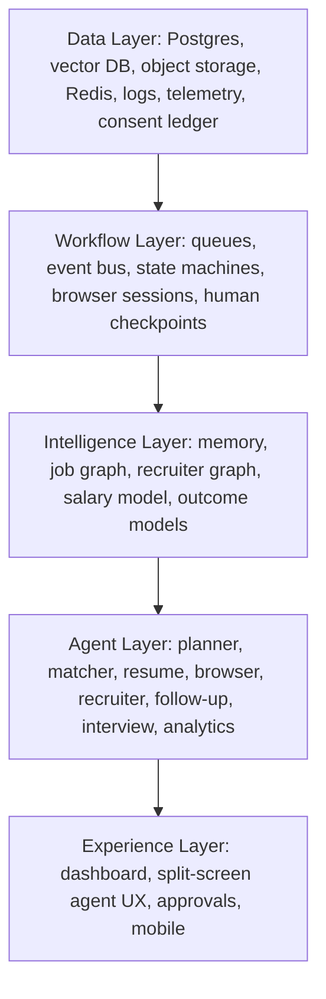

### Long-Term Defensibility

The durable moat is a private, user-permissioned outcome graph:

- Candidate attributes and career memory.
- Job and company metadata.
- Application artifact variants.
- Recruiter and referral paths.
- Browser automation traces.
- Interview and offer outcomes.
- User approvals, edits, skips, dislikes, and preferences.

Over time, the system can answer questions competitors cannot:

- Which bullet rewrite increases interview probability for this exact candidate segment?
- Which recruiter is likely to respond this week?
- Which jobs are fake, stale, or internally filled?
- Which missing skill blocks this user from a target salary band?
- Which outreach tone works for this user, industry, company type, and relationship distance?

## Section 2 - Core Product Pillars

| Pillar | Purpose | User Pain Solved | Technical Complexity | Revenue Impact | Competitive Moat |
|---|---|---|---|---|---|
| Autonomous AI Agents | Plan and execute job-search workflows | User does not want another dashboard to manage | Very high: orchestration, tool use, state, safety | Premium subscriptions, usage credits | Workflow and behavior moat |
| Career Memory Engine | Persistent profile, goals, proof, preferences, outcomes | Re-explaining yourself to every tool | High: memory schemas, vector retrieval, consent | Higher retention and conversion | Personal AI memory moat |
| Job Intelligence Graph | Structured market graph of jobs, skills, companies, salaries | Endless irrelevant listings and fake jobs | High: ingestion, dedup, embeddings, ranking | Core free-to-paid upgrade | Data moat |
| Recruiter Intelligence Layer | Model recruiters, employees, referrals, outreach timing | Cold applications disappear | Very high: graph data, privacy, inference | Pro tier and enterprise/API | Network graph moat |
| Application Automation | Browser agents that submit approved applications | Repetitive forms and missed opportunities | Very high: Playwright, CAPTCHA policy, ATS adapters | Highest willingness to pay | Automation moat |
| Personalized AI Coaching | Skills, positioning, interview, and salary guidance | Users do not know why they are stuck | Medium-high: outcome models and LLM coaching | Retention, upsell, paid plans | Outcome learning moat |
| Career Simulation Engine | Simulate job-search strategy and expected outcomes | Users choose volume blindly | Medium-high: models, benchmarks | Differentiated premium feature | Decision intelligence moat |
| AI Interview Training | Role-specific interviews with feedback and drills | Interviews are high stakes and hard to practice | Medium: speech/video optional later | Add-on revenue | Performance data moat |
| Salary Negotiation AI | Offer analysis, scripts, negotiation strategy | Users leave money on table | Medium-high: salary data, coaching, legal-safe copy | High-value late funnel monetization | Compensation outcome moat |
| Trust, Compliance, and Control | Permissioning, audit trails, data privacy, user approval | Users fear bad automation | High: security, policy, UX | Enterprise readiness and trust | Trust moat |

### Pillar Details

#### 1. Autonomous AI Agents

Purpose: Convert the job search from manual task execution into supervised autonomy.

Core jobs:

- Build weekly search plans.
- Discover and rank opportunities.
- Decide which resume variant to use.
- Generate edits with explanations.
- Queue auto-apply tasks.
- Draft recruiter outreach.
- Follow up after no response.
- Prepare interview packs.
- Analyze outcomes.

Moat: every user approval, edit, skip, and outcome becomes training data for better agent policy.

#### 2. Career Memory Engine

Purpose: Store what the AI knows and how confident it is.

The memory engine should include:

- Facts: companies worked at, skills, titles, degrees.
- Preferences: remote, salary, industries, locations.
- Goals: target roles, seniority, timeline, risk tolerance.
- Evidence: quantified achievements, projects, links, documents.
- Style: voice, formality, preferred wording.
- Outcomes: which applications, messages, resumes, and interview answers worked.

Moat: memory gets more valuable as it deepens; switching costs rise naturally.

#### 3. Job Intelligence Graph

Purpose: Understand the labor market at entity level, not just text level.

Entities:

- JobPosting.
- Company.
- Recruiter.
- HiringTeam.
- Skill.
- RoleTaxonomy.
- Location.
- CompensationBand.
- ATSPlatform.
- ApplicationChannel.

Edges:

- company_has_job.
- job_requires_skill.
- recruiter_posted_job.
- user_matches_job.
- user_applied_to_job.
- employee_can_refer.
- company_similar_to_company.

Moat: ranking improves as the graph accumulates outcome labels.

#### 4. Recruiter Intelligence Layer

Purpose: Turn invisible hiring networks into actionable paths.

It should answer:

- Who is likely attached to this role?
- Who has posted about hiring recently?
- Which employee can refer the user?
- What relationship path is warmest?
- When should outreach be sent?
- What message should be used?

Moat: public job data is copyable; recruiter and referral outcome data is not.

#### 5. Application Automation

Purpose: Eliminate repetitive application work while preserving trust.

Core capabilities:

- Detect fields.
- Fill forms.
- Upload correct resume variant.
- Generate dynamic answers.
- Pause on sensitive questions.
- Record browser trace.
- Recover from failure.
- Respect site rules and user-configured limits.

Moat: reliable automation across ATS platforms is operationally difficult and creates compounding adapters.

#### 6. Personalized AI Coaching

Purpose: Tell the user what to do next with evidence.

Examples:

- "You are underperforming for staff backend roles because your leadership examples are too vague."
- "Your data platform roles convert 2.3x better than general full-stack roles."
- "You need one measurable AI infrastructure project to compete for this cluster."

Moat: coaching is strongest when tied to real user outcomes.

#### 7. Career Simulation Engine

Purpose: Forecast search strategies.

Inputs:

- Target roles.
- Application volume.
- channel mix.
- resume quality.
- referral coverage.
- current market supply/demand.
- user constraints.

Outputs:

- Expected interviews.
- Time to first response.
- Skill gaps with ROI.
- Best channel allocation.
- Offer probability by segment.

#### 8. AI Interview Training

Purpose: Convert job intelligence into interview-specific preparation.

Artifacts:

- Company brief.
- Role rubric.
- Likely questions.
- STAR story bank.
- Technical drill plan.
- Interview feedback memory.

#### 9. Salary Negotiation AI

Purpose: Help users turn offers into better compensation.

Capabilities:

- Market range estimate.
- Equity and benefits analysis.
- Counteroffer scripts.
- BATNA strategy.
- Recruiter email drafts.
- Risk scoring by company and stage.

#### 10. Trust, Compliance, and Control

Purpose: Make autonomy usable.

Requirements:

- Approval modes: manual, co-pilot, autopilot.
- Consent ledger for data sources.
- Audit trail per agent action.
- Explainable recommendations.
- "Never apply to" and "always pause on" policies.
- Data export and deletion.
- Per-integration permission scopes.

## Section 3 - AI Agent System Design

### Agent Topology

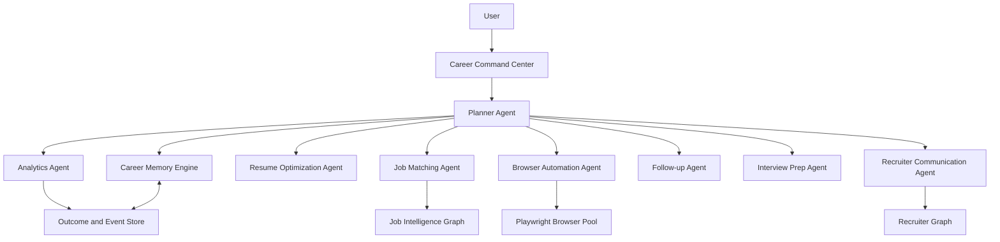

### Core Agents

| Agent | Responsibility | Inputs | Outputs | Critical Guardrails |
|---|---|---|---|---|
| Planner Agent | Decompose goals into workflows | user goal, memory, current market, credits, policies | workflow plan, task graph | cannot submit external action without policy check |
| Job Matching Agent | Rank and explain jobs | resume memory, job graph, preferences | ranked feed, match reasons, risk flags | avoid unsupported claims |
| Resume Optimization Agent | Generate role-specific resume variants | base resume, job description, proof memory | diff, PDF/JSON variant, ATS score | no fabricated experience |
| Browser Automation Agent | Execute applications | approved task, credentials/token vault, job URL | application trace, status, artifacts | pause on CAPTCHA, legal, demographic, payment, unexpected consent |
| Recruiter Communication Agent | Draft and schedule outreach | recruiter graph, user style, job context | email/LinkedIn drafts, timing | user approval required for first send |
| Follow-up Agent | Track and trigger follow-ups | application events, recruiter activity | follow-up drafts, reminders | rate limits and tone controls |
| Interview Prep Agent | Generate prep plans | job/company/recruiter memory | mock interview, briefs, story bank | factual citation for company claims |
| Analytics Agent | Learn from outcomes | events, applications, user edits | insights, experiments, model features | privacy and aggregation policy |

### Agent Communication

Use event-driven orchestration, not chatty synchronous calls.

Event classes:

- command: user or planner asks a workflow to begin.
- domain event: fact occurred.
- agent event: agent step changed state.
- approval event: user approved, rejected, edited, or paused.
- telemetry event: cost, latency, errors, token usage.

Recommended envelope:

```ts
type CareerEvent<TPayload> = {
  id: string;
  traceId: string;
  workflowId: string;
  userId: string;
  type: string;
  version: number;
  source: "user" | "planner" | "agent" | "worker" | "webhook";
  payload: TPayload;
  createdAt: string;
  idempotencyKey?: string;
  visibility: "user_visible" | "internal" | "sensitive";
};
```

### Shared Memory Systems

| Memory Type | Store | Retention | Use |
|---|---|---|---|
| Session memory | Redis | hours-days | current workflow state, locks, browser session state |
| Working memory | Postgres JSONB | workflow lifetime | plan steps, intermediate artifacts |
| Long-term factual memory | Postgres relational | until deletion | profile, jobs, applications, outcomes |
| Semantic memory | pgvector/Pinecone/Qdrant | until deletion | resume chunks, job chunks, recruiter notes, interview answers |
| Behavioral memory | Postgres event store + warehouse | consent-based | clicks, edits, approvals, skips, conversion labels |
| Browser memory | object storage + Postgres refs | 30-180 days | screenshots, traces, DOM snapshots, logs |

### Agent State Handling

Use explicit state machines for long-running workflows. Do not rely on LLM conversation state.

Workflow states:

- draft.
- planned.
- waiting_for_data.
- waiting_for_approval.
- queued.
- running.
- blocked.
- retrying.
- completed.
- failed.
- canceled.

Task states:

- pending.
- eligible.
- locked.
- active.
- paused.
- succeeded.
- failed_retryable.
- failed_terminal.
- skipped_by_policy.

### Human Approval Checkpoints

Required approval for:

- submitting first application for a new ATS type.
- sending first recruiter message to a new contact.
- answering legal authorization questions.
- answering demographic/self-identification questions.
- salary expectation below user's floor.
- relocation/commute commitments.
- anything involving payment, subscriptions, consent, references, background checks, or assessments.
- any model uncertainty above threshold.

Approval modes:

| Mode | Description | Target User |
|---|---|---|
| Manual | AI drafts only | trust-building, free tier |
| Co-pilot | AI fills and pauses before submit | default paid tier |
| Autopilot with rules | AI submits only within allowed policies | power users |
| Managed | human QA or expert review | premium and enterprise |

### Long-Running Workflow Sequence

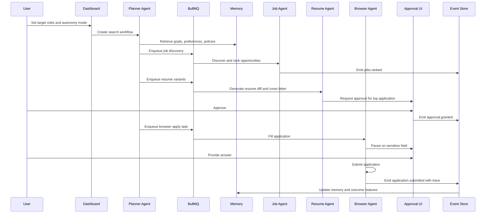

### Event Flow Diagram

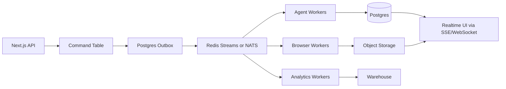

### Retry Systems and Failure Recovery

Use layered recovery:

1. Idempotency keys per workflow step.
2. BullMQ retries for transient API/browser failures.
3. Dead-letter queues for manual inspection.
4. Browser trace replay for failed applications.
5. Adapter-level fallback: ATS-specific parser first, generic DOM agent second, manual route third.
6. Agent self-critique only before external actions, not as an infinite retry loop.
7. Circuit breakers per provider, ATS, model, and data source.

### Recommended Libraries and Tooling

| Need | Recommended |
|---|---|
| Queue | BullMQ now; consider Temporal for complex durable workflows |
| Event bus | Redis Streams short term; NATS/Kafka when event volume grows |
| Agent orchestration | Vercel AI SDK for app integration, LangGraph for stateful graphs, custom TypeScript state machines for external actions |
| Browser automation | Playwright, Browserless or self-hosted Chromium pools, Stagehand-like DOM/action abstraction if acceptable |
| Vector DB | pgvector for MVP, Qdrant or Pinecone for scale and hybrid search |
| Search | Meilisearch now; OpenSearch/Elasticsearch for larger job graph |
| Observability | OpenTelemetry, Sentry, Langfuse/Phoenix for LLM traces |
| Feature flags | Existing FeatureFlag table, later LaunchDarkly/OpenFeature |
| Policy engine | Open Policy Agent or custom policy evaluator |
| Secrets | Doppler/Infisical/1Password service accounts, cloud KMS |
| Browser containers | Docker, Kubernetes Jobs, Playwright images, Firecracker/microVMs later |

### Model Routing Strategy

Use a model gateway with task-level routing:

| Task | Model Class | Notes |
|---|---|---|
| job parsing | cheap structured extraction | high throughput, JSON schema |
| embedding | embedding model | normalize resume, jobs, companies, recruiter notes |
| ranking explanation | mid-tier reasoning | avoid expensive model for every job |
| resume rewrite | strong writing model | needs factual guardrails |
| planner | strongest reasoning model | low volume, high impact |
| browser DOM field mapping | vision/text model when DOM ambiguous | screenshots only when needed |
| recruiter outreach | strong writing model | style memory matters |
| interview simulation | mixed | cheap question generation, stronger feedback |
| analytics insights | mid-tier | use deterministic metrics first |

Cost strategy:

- Cache embeddings by content hash.
- Deduplicate jobs before embedding.
- Use structured extraction with small models.
- Batch job scoring.
- Run expensive planner only on top opportunities.
- Generate resume variants only after shortlist threshold.
- Use deterministic rules for policy gates.
- Store prompt, completion, and cost in AIUsage.
- Add per-plan AI credit budgets.

## Section 4 - Career Memory Engine

### Memory Design Principles

1. Permissioned: users can inspect, edit, delete, and export memory.
2. Typed: important facts should be relational, not only vector text.
3. Evidence-backed: resume claims must point to source evidence.
4. Confidence-scored: inferred memories must have confidence and provenance.
5. Outcome-aware: success and failure patterns are first-class memory.
6. Retrieval-specific: each agent retrieves only the memory it needs.

### Memory Schema

Recommended new Prisma models:

```prisma
model CareerProfile {
  id        String   @id @default(uuid()) @db.Uuid
  userId    String   @unique @db.Uuid
  headline  String?
  summary   String?
  goals     Json
  preferences Json
  constraints Json
  salaryExpectation Json?
  autonomyPolicy Json
  createdAt DateTime @default(now())
  updatedAt DateTime @updatedAt
}

model CareerMemory {
  id          String   @id @default(uuid()) @db.Uuid
  userId      String   @db.Uuid
  type        String   // skill, achievement, preference, weakness, style, outcome_pattern
  title       String
  content     String
  evidenceRef String?
  confidence  Float    @default(0.7)
  source      String   // user, resume_parse, agent_inferred, outcome_model
  visibility  String   @default("private")
  expiresAt   DateTime?
  createdAt   DateTime @default(now())
  updatedAt   DateTime @updatedAt

  @@index([userId, type])
}

model MemoryEmbedding {
  id        String   @id @default(uuid()) @db.Uuid
  userId    String   @db.Uuid
  memoryId  String?  @db.Uuid
  entityType String
  entityId   String?
  contentHash String
  embedding  Unsupported("vector(1536)")
  metadata   Json?
  createdAt  DateTime @default(now())

  @@index([userId, entityType])
}
```

If Prisma vector support is awkward, keep embeddings in a separate table via raw SQL migration or use Qdrant.

### What the AI Should Remember

| Category | Examples | Store |
|---|---|---|
| Preferences | remote, location, industry, company size, visa needs | CareerProfile.preferences |
| Career goals | role targets, timeline, seniority, compensation | CareerProfile.goals |
| Past applications | company, role, variant, channel, outcome | Application + ApplicationArtifact |
| Recruiter responses | contact, message, response, sentiment | RecruiterInteraction |
| Skills | explicit skills, inferred skills, confidence | SkillProfile |
| Weaknesses | missing keywords, interview gaps, unclear stories | CareerMemory(type=weakness) |
| Interview performance | score, question type, answer issues | InterviewSession + memory |
| Salary expectations | floor, target, dream, tradeoffs | CareerProfile.salaryExpectation |
| Writing style | tone, phrases to avoid, preferred narrative | CareerMemory(type=style) |
| Success patterns | high-converting companies, bullets, channels | CareerMemory(type=outcome_pattern) |

### Long-Term vs Short-Term Memory

Short-term memory:

- active workflow plan.
- selected jobs.
- current application form state.
- browser DOM mapping.
- pending approvals.

Long-term memory:

- verified profile facts.
- canonical achievements.
- preference history.
- career strategy.
- application outcomes.
- recruiter graph edges.
- interview and offer learnings.

Promotion rules:

- user explicitly confirms a fact.
- fact appears in multiple trusted documents.
- user repeatedly edits generated content the same way.
- outcome model finds statistically meaningful pattern.
- recruiter/interview result confirms hypothesis.

### Retrieval Architecture

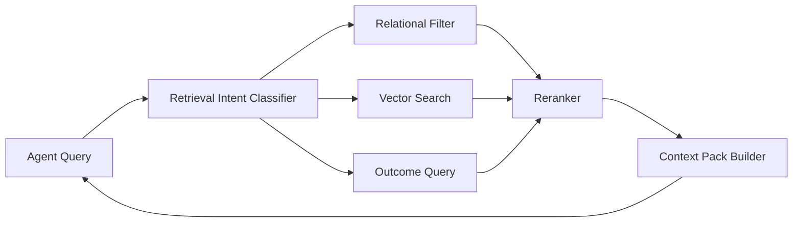

Retrieval examples:

- Resume agent retrieves achievements, skills, source resume, job requirements, style, and no-fabrication policy.
- Browser agent retrieves form answers, approved demographic policy, resume variant, and job-specific cover letter.
- Recruiter agent retrieves relationship graph, user style, target role, company research, and prior outreach results.
- Analytics agent retrieves application outcomes, time windows, resume variants, channel data, and user goals.

### Embeddings Strategy

Embed:

- resume chunks by section.
- achievement claims.
- job descriptions.
- company pages and hiring signals.
- recruiter posts and interactions.
- interview answers.
- application questions and answers.

Do not embed:

- secrets.
- raw auth tokens.
- sensitive demographic answers unless explicitly consented and required.
- full browser traces by default.

Use hybrid search:

- lexical filters for exact skills, title, company, location.
- vector search for semantic similarity.
- reranking for final context.

### Learning Loops

Learning events:

- job viewed.
- job skipped.
- resume edit accepted/rejected.
- application approved/submitted.
- recruiter opened/replied.
- interview scheduled.
- rejection received.
- offer received.
- user changed preference.

Outcome labels:

- no_response_14d.
- recruiter_response.
- screen.
- interview_loop.
- offer.
- rejected.
- withdrawn.
- accepted.

Personalization loop:

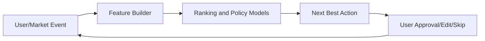

## Section 5 - Autonomous Apply Engine

### Product Principle

The apply engine must be powerful but conservative. A single bad application can damage trust. Default to co-pilot mode, earn autonomy over time, and make every action inspectable.

### Browser Automation Architecture

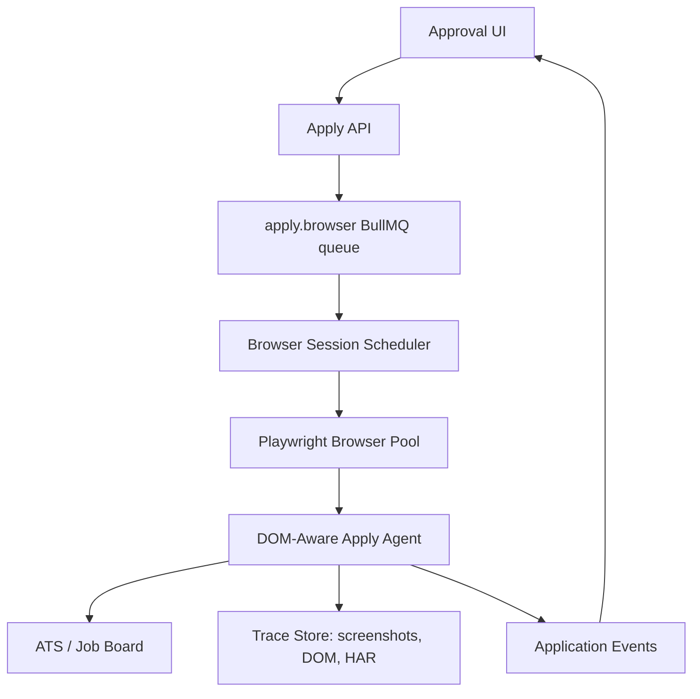

### Worker Architecture

Queues:

- apply.plan: validate job, profile, resume, policies.
- apply.prepare: generate resume variant, cover letter, application answers.
- apply.browser: run Playwright session.
- apply.approval: pause until user action.
- apply.recovery: retry or route to manual completion.
- apply.audit: store trace and artifacts.

Worker types:

| Worker | Responsibility | Scaling Unit |
|---|---|---|
| Planner worker | decides if job is eligible | CPU/light LLM |
| Document worker | resume and cover generation | LLM/token budget |
| Browser worker | Playwright sessions | memory/CPU/browser |
| Vision worker | screenshot understanding | GPU/API budget |
| Audit worker | trace compression, storage | IO |

### DOM Understanding

Use a layered strategy:

1. ATS-specific adapters for Greenhouse, Lever, Workday, Ashby, SmartRecruiters, Taleo, iCIMS.
2. Semantic DOM parser:
   - label association.
   - ARIA roles.
   - placeholder text.
   - input type.
   - select options.
   - nearby text.
   - hidden required fields.
3. LLM field mapper:
   - maps form fields to profile memory.
   - returns structured actions.
   - includes uncertainty score.
4. Vision fallback:
   - screenshot for inaccessible or canvas-heavy pages.
5. Human pause:
   - unknown required fields.
   - sensitive fields.
   - low confidence.

Field mapping output:

```ts
type FieldMapping = {
  selector: string;
  label: string;
  fieldType: "text" | "textarea" | "select" | "checkbox" | "radio" | "file";
  valueSource: "profile" | "resume" | "generated" | "user_required" | "policy_blocked";
  value?: string;
  confidence: number;
  sensitive: boolean;
  requiresApproval: boolean;
};
```

### CAPTCHA Handling Strategy

Do not attempt to bypass CAPTCHA. Correct strategy:

- Detect CAPTCHA reliably.
- Pause and ask user to solve in live browser session.
- Support remote browser handoff.
- Mark ATS/source with CAPTCHA frequency.
- Prefer official APIs, email apply flows, or user-assisted sessions where available.
- Use CAPTCHA as a trust boundary, not a hacking target.

### Human Verification Checkpoints

Pause before:

- final submit in first applications.
- legal work authorization fields.
- demographic fields.
- equal opportunity questions if user has not set policy.
- salary below floor or above strategic maximum.
- cover letter with inferred facts.
- file upload mismatch.
- third-party account creation.
- assessment or test.
- CAPTCHA.

### Anti-Ban and Platform Respect Strategy

The goal is reliability and compliance, not evasion.

- Respect robots, ToS, and rate limits.
- Use user-authenticated sessions only with consent.
- Keep application volume within human-plausible user-configured limits.
- Avoid duplicate applications.
- Do not mass spam recruiters.
- Rotate through official provider APIs where possible.
- Maintain source-specific cooldowns.
- Record provenance for every submission.
- Provide opt-out lists for companies and platforms.

### Multi-Tab Orchestration

Use one browser context per user workflow and bounded tabs:

- max 1-3 active tabs per user by default.
- source-level concurrency caps.
- per-user lock to avoid duplicate submissions to same company/job.
- shared session storage only when user consented.
- isolate browser contexts per user.

### Error Recovery

| Failure | Recovery |
|---|---|
| selector changed | rerun DOM parser and mapper |
| upload failed | retry with alternate file path and verify filename |
| network timeout | retry with backoff and resume from checkpoint |
| login required | pause and handoff to user |
| unknown required field | ask user, store answer if reusable |
| CAPTCHA | user solve |
| duplicate application | mark duplicate, stop |
| confirmation missing | screenshot, inspect DOM, route to manual review |

### Resume Variant Selection

Decision inputs:

- job family.
- seniority.
- required skills.
- company stage and domain.
- user's strongest proof points.
- previous conversion data.
- ATS keyword constraints.

Variant policy:

- never invent claims.
- maintain canonical source-of-truth resume.
- generate diffs, not opaque rewrites.
- store each variant as artifact with job/application reference.

### Dynamic Cover Letter Generation

Generate only when useful:

- required by ATS.
- company values role-specific motivation.
- user has strong company-specific reason.
- referral path needs narrative.

Avoid generic cover letters. Store templates but personalize with company facts and user evidence.

### Security Considerations

- Encrypt browser session tokens and credentials with KMS.
- Avoid storing passwords when OAuth/session handoff is possible.
- Isolate browser containers per user.
- Prevent cross-user trace leakage.
- Redact secrets and sensitive fields in traces.
- Sign artifact URLs with short expiration.
- Maintain consent records per source.
- Strict audit log for external actions.

### Cloud Deployment Architecture

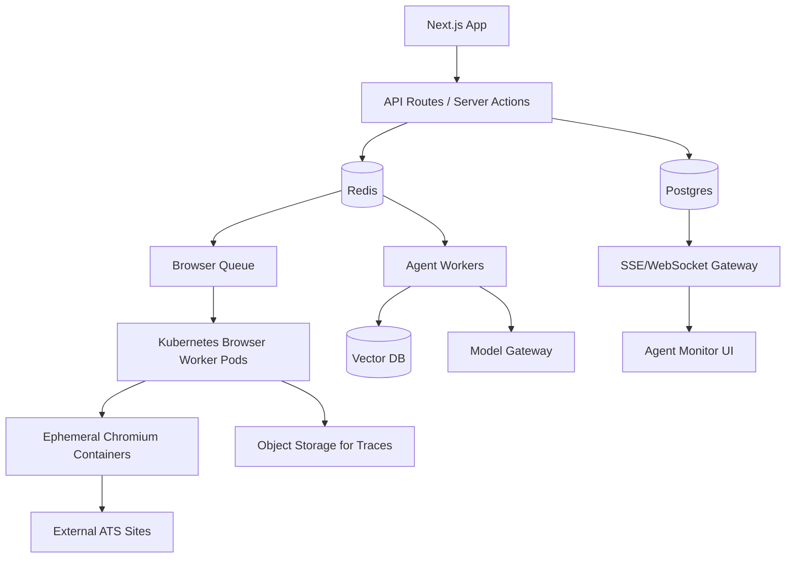

### Scaling Strategy

MVP:

- Railway/Fly/Render worker nodes.
- Browserless or managed Playwright pool.
- BullMQ queues.
- pgvector.

Growth:

- Kubernetes with browser worker node pool.
- Redis Cluster or managed Valkey.
- NATS/Kafka.
- Temporal for durable workflows.
- OpenSearch for job graph.
- dedicated model gateway service.

Scale bottlenecks:

- browser memory per session.
- job source rate limits.
- LLM cost for resume variants.
- vector search latency.
- approval UX throughput.
- compliance review and support.

## Section 6 - Job Intelligence System

### Job Aggregation Architecture

Sources:

- company ATS pages.
- Greenhouse/Lever/Ashby APIs and boards.
- job board APIs where licensed.
- user-submitted URLs.
- recruiter posts where permitted.
- partner feeds.
- webhooks from companies/recruiters later.

Pipeline:

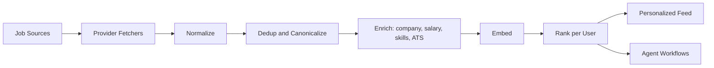

### Ranking Systems

Use a multi-stage ranker:

1. Hard filters:
   - location.
   - authorization.
   - salary floor.
   - blocked companies.
   - remote/hybrid preference.
2. Candidate generation:
   - title taxonomy match.
   - skill overlap.
   - semantic similarity.
   - company affinity.
3. Feature ranker:
   - match score.
   - interview probability.
   - hiring urgency.
   - ghost risk.
   - salary fit.
   - referral availability.
   - application effort.
4. LLM explanation:
   - top reasons.
   - risks.
   - suggested positioning.

### Match Scoring Engine

Score components:

| Feature | Weight MVP | Notes |
|---|---:|---|
| title/seniority fit | 20 | role taxonomy |
| required skill fit | 20 | exact + semantic |
| experience evidence | 15 | proof-backed achievements |
| preference fit | 15 | location, remote, industry |
| salary fit | 10 | estimated if missing |
| company quality | 8 | growth, reviews, stability |
| recruiter/referral signal | 7 | warm path |
| application feasibility | 5 | ATS difficulty, required fields |

Later replace weights with learned-to-rank model using outcomes.

### Skill Gap Analysis

Outputs:

- critical missing requirements.
- nice-to-have gaps.
- evidence gaps where user has skill but resume lacks proof.
- short learning plan.
- "do not apply" blockers.
- interview prep warnings.

### Recruiter Likelihood Scoring

Predict whether outreach/application will receive attention:

Features:

- recency of posting.
- recruiter activity.
- job repost frequency.
- company hiring velocity.
- user's role fit.
- referral distance.
- past response rates by channel.
- volume of applicants if available.
- ATS source.

### Hiring Urgency Prediction

Signals:

- posted in last 24-72 hours.
- multiple similar openings.
- recruiter posts with urgency language.
- company funding/news/product launch.
- short application windows.
- reposted with changed compensation.
- high careers page update frequency.

### Ghost Job Detection

Signals:

- old posting with no changes.
- repeated reposting over months.
- company layoffs/hiring freeze.
- role absent from company ATS but present on job boards.
- no recruiter/hiring manager activity.
- title/location mismatch across sources.
- impossible compensation or requirements.
- application link dead or redirects oddly.

### Company Quality Scoring

Dimensions:

- financial health.
- hiring velocity.
- layoffs and attrition signals.
- employee sentiment.
- manager quality signals where available.
- compensation competitiveness.
- remote policy stability.
- visa friendliness.
- interview process quality from user reports.

### Salary Prediction Models

MVP:

- parse posted ranges.
- infer from role/seniority/location/company/industry.
- compare to known public salary datasets and user outcomes.

Advanced:

- quantile regression.
- company-specific compensation bands.
- equity value and liquidity risk.
- negotiation uplift model.

### ML Pipeline

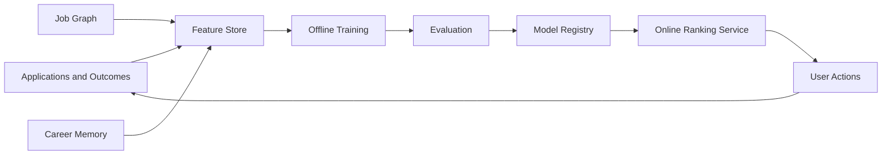

Training data strategy:

- MVP: heuristic scoring plus user feedback.
- Phase 2: outcome-labeled per-user and cross-user models.
- Phase 3: marketplace-level models with privacy-preserving aggregation.
- Phase 4: domain-specific models for industries and role families.

## Section 7 - Recruiter Intelligence Layer

### System Goals

The recruiter layer should:

- identify likely hiring stakeholders.
- detect warm connections.
- map referral paths.
- track recruiter activity.
- predict response probability.
- optimize outreach timing and message.
- learn which outreach converts.

### Graph Architecture

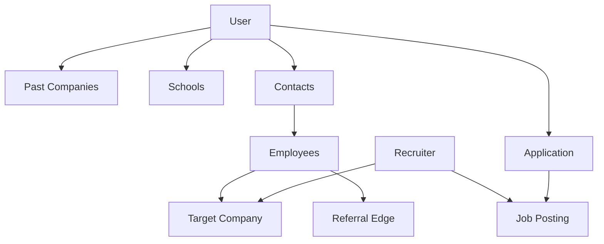

Node types:

- Person.
- Recruiter.
- Employee.
- Company.
- JobPosting.
- UserContact.
- School.
- PastEmployer.
- Community.

Edge types:

- worked_at.
- studied_at.
- follows.
- connected_to.
- referred.
- posted.
- hired_for.
- responded_to.
- ignored.
- introduced.

### Relationship Mapping

Data sources with consent:

- user-imported contacts.
- LinkedIn exports where user provides data.
- Gmail/Outlook email metadata if integrated later.
- calendar interview participants.
- resume employment history.
- public recruiter posts where permitted.
- user-labeled relationships.

Relationship strength:

| Signal | Meaning |
|---|---|
| direct contact | highest confidence |
| prior email thread | strong |
| same company overlap | medium |
| same school/community | medium-low |
| 2-hop employee path | useful for referral |
| public recruiter activity only | cold |

### Response Probability

Features:

- warm path strength.
- recruiter recency.
- message personalization quality.
- fit score.
- company hiring urgency.
- prior interaction history.
- time/day/channel.
- seniority alignment.
- user's social proof.

### Outreach Timing

Rules:

- prioritize 24-72 hours after job posted.
- avoid weekends unless user data says otherwise.
- follow up after 4-7 business days.
- stop after 2-3 unanswered messages unless recruiter engages.
- avoid duplicate outreach to multiple recruiters at same company without user approval.

### Personalized Outreach

Message generator context:

- concise user positioning.
- specific role.
- one or two proof points.
- warm connection reason.
- company-specific reason.
- ask: referral, hiring context, or quick guidance.

Guardrails:

- no fake familiarity.
- no exaggerated credentials.
- no mass-send tone.
- user approval for new contacts.

## Section 8 - UI/UX System

### Product Experience Principle

The interface should feel like a command center for serious career execution: calm, dense, transparent, and controllable. It should not feel like a marketing page, chatbot toy, or generic resume template gallery.

### Information Architecture

Primary nav:

1. Command Center.
2. Opportunities.
3. Agent Runs.
4. Applications.
5. Resume Lab.
6. Network.
7. Interview Prep.
8. Analytics.
9. Memory and Settings.

### Dashboard UX

Command Center layout:

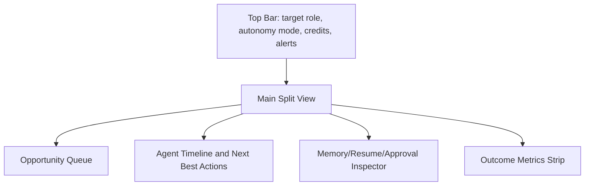

Core widgets:

- Today's agent plan.
- Top jobs found.
- Approvals needed.
- Applications submitted.
- Recruiter follow-ups due.
- Interview prep tasks.
- Conversion funnel.
- Memory updates pending confirmation.

### AI-First Workflows

User flow should be action-oriented:

- "Find me 20 best-fit jobs this week."
- "Prepare applications for these 5 roles."
- "Show me why this job is worth applying to."
- "Apply after I approve the resume diff."
- "Find referral paths for this company."
- "Prep me for recruiter screen tomorrow."

### Multi-Panel Layouts

Split-screen agent UX:

- Left: job/recruiter/application context.
- Center: live browser or document diff.
- Right: agent reasoning, checkpoints, and controls.

Do not hide automation behind a spinner. Show:

- current step.
- reason for action.
- confidence.
- cost/credits.
- next checkpoint.
- trace link.

### Agent Monitoring UI

Show agent runs as timelines:

- planned.
- queued.
- running.
- paused.
- needs approval.
- completed.
- failed.

Each step should expose:

- input.
- output artifact.
- model/tool used.
- elapsed time.
- error/retry.
- user action.

### Live Browser Tracking

Provide:

- live screenshot stream or periodic snapshots.
- current URL and ATS platform.
- form completion progress.
- pause reason.
- takeover button.
- trace download for support.

### Resume Editing UX

Resume Lab:

- canonical resume on left.
- job-specific variant on right.
- AI diff with accept/reject per bullet.
- evidence panel showing source proof.
- ATS keyword coverage.
- recruiter readability score.
- version history.

### AI Approval Systems

Approval cards should show:

- action being requested.
- why it matters.
- what will be sent/submitted.
- risk flags.
- editable fields.
- approve, edit, skip, always allow similar.

### Minimalist Design Language

- Dense, work-focused layouts.
- 8px or smaller card radius.
- restrained color system with semantic accents.
- status icons for agent state.
- no decorative hero treatment inside product.
- typography optimized for scanning.
- animations only for state transitions, live progress, and confirmations.

### Mobile UX

Mobile should focus on approvals and monitoring:

- approve/reject application packets.
- edit short answers.
- receive alerts.
- view job cards.
- monitor live runs.
- respond to recruiter drafts.

Do not force heavy resume editing on mobile except quick edits.

### Retention Loops

- daily opportunity digest.
- weekly search performance review.
- "memory improved" confirmations.
- interview prep triggered by calendar/application stage.
- application follow-up nudges.
- salary insights after offer stage.
- streaks only if they map to real career progress, not vanity usage.

## Section 9 - Technical Architecture

### Target Monorepo Structure

```text
apps/
  web/                       # Next.js app
  worker/                    # BullMQ/Temporal workers
  browser-worker/            # Playwright execution service
  realtime/                  # SSE/WebSocket gateway if separated
packages/
  db/                        # Prisma schema, migrations, repositories
  ai/                        # model gateway, prompts, evals
  agents/                    # agent graphs, tools, policies
  memory/                    # retrieval and memory schemas
  jobs/                      # ingestion, normalization, ranking
  browser/                   # ATS adapters, DOM mapper
  events/                    # event schemas, outbox, bus clients
  ui/                        # shared components
  observability/             # logging, tracing, metrics
```

Short-term, this repo can keep current structure and add:

```text
lib/agents/
lib/memory/
lib/workflows/
lib/browser/
lib/policies/
app/(dashboard)/agents/
app/(dashboard)/network/
docs/strategy/
```

### Service Boundaries

| Service | Owns | Database Access | Notes |
|---|---|---|---|
| Web app | UI, auth, APIs, approvals | read/write via repositories | Next.js |
| Agent worker | planning, document generation, matching | read/write | BullMQ now |
| Browser worker | Playwright execution | limited write via service API | isolated |
| Job ingestion worker | provider fetch, dedup, enrichment | write jobs | scheduled |
| Realtime gateway | events to UI | read event stream | SSE first |
| Model gateway | model routing and cost | AIUsage write | central policy |
| Analytics worker | snapshots, features, insights | read/write aggregates | async |

### Backend Architecture

Recommended patterns:

- API routes for user-initiated commands.
- Postgres outbox for reliable event publishing.
- BullMQ for background jobs.
- Service classes for domain logic.
- Zod schemas for payloads.
- IdempotencyKey table for external actions.
- AuditEvent for user-visible actions.
- QueueEvent for operations.

### Database Schemas

Add core models:

```text
CareerProfile
CareerMemory
MemoryEmbedding
WorkflowRun
WorkflowTask
AgentRun
AgentStep
ApprovalRequest
ApplicationArtifact
BrowserSession
BrowserTrace
JobSource
Company
Recruiter
Person
RelationshipEdge
OutreachMessage
OutcomeEvent
ExperimentAssignment
```

WorkflowRun:

```prisma
model WorkflowRun {
  id        String   @id @default(uuid()) @db.Uuid
  userId    String   @db.Uuid
  type      String
  status    String
  goal      String
  plan      Json
  policy    Json
  createdAt DateTime @default(now())
  updatedAt DateTime @updatedAt
  completedAt DateTime?

  @@index([userId, status, createdAt])
}
```

ApprovalRequest:

```prisma
model ApprovalRequest {
  id          String   @id @default(uuid()) @db.Uuid
  userId      String   @db.Uuid
  workflowId  String?  @db.Uuid
  type        String
  status      String   @default("pending")
  title       String
  summary     String
  payload     Json
  riskFlags   Json?
  expiresAt   DateTime?
  decidedAt   DateTime?
  createdAt   DateTime @default(now())

  @@index([userId, status, createdAt])
}
```

BrowserSession:

```prisma
model BrowserSession {
  id          String   @id @default(uuid()) @db.Uuid
  userId      String   @db.Uuid
  workflowId  String?  @db.Uuid
  status      String
  targetUrl   String
  platform    String?
  traceUrl    String?
  lastStep     Json?
  createdAt   DateTime @default(now())
  updatedAt   DateTime @updatedAt

  @@index([userId, status])
}
```

### API Architecture

Key endpoints:

```text
POST /api/v1/workflows
GET  /api/v1/workflows/:id
POST /api/v1/workflows/:id/cancel
GET  /api/v1/agents/runs
GET  /api/v1/approvals
POST /api/v1/approvals/:id/approve
POST /api/v1/approvals/:id/reject
POST /api/v1/jobs/discover
GET  /api/v1/jobs/feed
POST /api/v1/applications/prepare
POST /api/v1/applications/:id/apply
GET  /api/v1/browser-sessions/:id/stream
GET  /api/v1/memory
PATCH /api/v1/memory/:id
DELETE /api/v1/memory/:id
```

### Webhook Systems

Inbound:

- email events for recruiter replies if Gmail/Outlook added.
- calendar events for interviews if calendar added.
- payment/subscription events.
- provider feed updates.
- browser worker completion callbacks.

Outbound:

- application submitted.
- approval required.
- interview scheduled.
- weekly insight ready.
- data export ready.

### Rate Limiting

Rate limit dimensions:

- user.
- plan.
- IP.
- action type.
- external source.
- model spend.
- browser sessions.
- recruiter outreach.

Use Upstash ratelimit short term, Redis token buckets for worker actions.

### Security Architecture

Core controls:

- NextAuth session security.
- row-level access in repositories.
- encrypt sensitive user data.
- KMS for session tokens.
- least-privilege browser worker API keys.
- strict CORS and CSRF protections.
- audit all external actions.
- redact PII in logs and traces.
- consent records for integrations.
- data export/deletion workflows.
- separate production/staging model keys.

### Observability

Trace each workflow:

- user command.
- planner run.
- queue job.
- model calls.
- browser actions.
- approvals.
- external submission.
- outcome updates.

Metrics:

- applications prepared/submitted.
- approval latency.
- browser success rate.
- ATS failure rate.
- model cost per application.
- interview conversion.
- source quality.
- ghost job rate.
- time to first response.

### CI/CD

Current scripts already support quality, lint, tests, typecheck, build. Add:

- prompt/eval tests.
- agent policy tests.
- browser adapter integration tests.
- Prisma migration validation.
- Playwright tests for dashboard and browser UI.
- canary rollout via feature flags.
- worker deployment smoke test.

### CDN and Caching

- CDN for static assets and resume PDFs.
- cache job feed pages by user segment carefully; user-specific results need private cache.
- cache company profiles and public job enrichments.
- cache embeddings by content hash.
- cache LLM extraction outputs by normalized job hash.

## Section 10 - Competitive Moat

### Data Moat

The core data asset is not resumes; it is the full candidate-market-outcome graph:

- who applied.
- to what job.
- with which resume variant.
- via which channel.
- with which referral path.
- after which AI recommendation.
- resulting in which recruiter/interview/offer outcome.

### Behavioral Moat

The system learns:

- what users approve.
- what users skip.
- what users edit.
- what autonomy level they trust.
- what jobs they actually pursue.
- what compromises they make.

### AI Memory Moat

Users will not want to rebuild:

- career profile.
- proof library.
- writing style.
- application history.
- interview notes.
- salary strategy.
- recruiter graph.

### Recruiter Graph Moat

Recruiter response and referral data become increasingly valuable:

- recruiter activity recency.
- company hiring behavior.
- referral conversion.
- warm path efficacy.
- outreach tone by segment.

### Workflow Moat

Reliable auto-apply is hard because every ATS is different. Each adapter, trace, failure, and recovery improves the system.

### Distribution Moat

Distribution channels:

- job seekers sharing interview wins.
- resume and application artifacts with subtle brand loops.
- university and bootcamp partnerships.
- career coaches using the platform.
- Chrome extension for job page capture.
- recruiter-side marketplace later.

### Automation Moat

Once the browser agent works across major ATS platforms, competitors face an operational mountain:

- browser infra.
- support burden.
- compliance.
- edge cases.
- traceability.
- user trust.
- source-specific rate management.

### Feedback Loop Moat

Every application creates data:

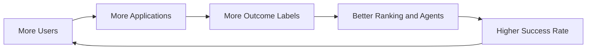

### Why Tailorec Cannot Easily Catch Up

If Tailorec remains a smart job portal, it can copy surface features but not quickly copy:

- persistent career memory.
- browser execution infrastructure.
- ATS-specific automation reliability.
- user approval and audit systems.
- recruiter graph outcome data.
- closed-loop model training from applications to offers.
- trust built through transparent automation.

The wedge is not "better matching." The wedge is "we do the work, learn from it, and get better every week."

## Section 11 - Execution Roadmap

### 30-Day Roadmap

Goal: turn the existing app into a credible AI Career OS prototype.

Build:

- CareerProfile and CareerMemory schema.
- WorkflowRun, AgentRun, ApprovalRequest schema.
- Agent Runs dashboard.
- Planner Agent v0 for "prepare applications for top jobs."
- Resume diff workflow with approval.
- Job feed ranking v1 using current JobOpportunity.
- Auto-apply packet generation: resume, cover letter, application answers.
- Event taxonomy and outbox table.
- Feature flags for agent features.

Do not build yet:

- full browser autopilot.
- recruiter graph.
- salary negotiation.
- complex ML training.

KPIs:

- time to prepare application packet.
- approval rate.
- resume edit accept rate.
- user activation: first approved application packet.

Hiring:

- founding full-stack/AI engineer.
- product designer with workflow UI strength.

### 90-Day Roadmap

Goal: ship co-pilot application automation for controlled ATS sources.

Build:

- Playwright browser worker.
- Greenhouse, Lever, Ashby adapters.
- generic DOM field mapper.
- live browser tracking UI.
- human approval checkpoints.
- trace storage.
- recruiter outreach drafts v0.
- company profile enrichment.
- ghost job and hiring urgency heuristics.
- outcome tracking and follow-up agent.
- eval suite for resume quality and hallucination.

KPIs:

- application packet to submitted conversion.
- browser success rate by ATS.
- average human time per application.
- interview response rate.
- cost per submitted application.

Hiring:

- browser automation engineer.
- infra/backend engineer.
- growth/product analytics lead.

Revenue:

- launch Pro subscription.
- charge AI credits for application automation.

### 6-Month Roadmap

Goal: become a daily-use job search command center.

Build:

- job aggregation from company ATS feeds and licensed APIs.
- personalized ranked feed.
- career memory editing UI.
- recruiter graph v1 from user-imported contacts and public data where permitted.
- outreach timing and follow-up workflows.
- interview prep tied to applications.
- learned ranker v1 from outcomes.
- compensation intelligence v0.
- Chrome extension or browser capture tool.
- team/admin dashboards for career coaches or bootcamps.

KPIs:

- weekly active job seekers.
- applications per active user.
- interview conversion lift vs baseline.
- retention after week 4.
- percentage of applications with referral/outreach.

Hiring:

- data/ML engineer.
- security/compliance engineer.
- customer success lead.
- partnerships lead.

Revenue:

- Pro and Max plans.
- career coach/team plan.
- university/bootcamp pilots.

### 12-Month Roadmap

Goal: defensible autonomous career platform with outcome-learning.

Build:

- multi-agent orchestration with durable workflows, likely Temporal if BullMQ becomes strained.
- learned match and response probability models.
- recruiter intelligence v2.
- broad ATS support.
- salary negotiation AI.
- interview simulation with voice/video optional.
- enterprise APIs for career platforms.
- privacy-preserving aggregate benchmarks.
- managed/human-reviewed premium tier.

KPIs:

- paid conversion.
- gross margin after AI/browser costs.
- interview rate lift.
- offer rate lift.
- net revenue retention.
- successful applications per browser hour.
- referral-assisted application conversion.

Hiring:

- head of engineering.
- head of growth.
- ML lead.
- design lead.
- support operations lead.
- legal/privacy advisor.

### Technical Risks

| Risk | Severity | Mitigation |
|---|---|---|
| Browser automation brittle | High | ATS adapters, traces, conservative rollout |
| LLM hallucination in resumes | High | evidence-backed rewriting and approval |
| Job source ToS issues | High | licensed feeds, official APIs, compliance review |
| Model costs too high | Medium | routing, caching, credits |
| Users distrust autopilot | High | co-pilot default, transparent traces |
| Outcome labels sparse | Medium | start with proxy events, import emails/calendar later |
| Recruiter graph privacy | High | explicit consent and user-controlled imports |

## Section 12 - Revenue Strategy

### Pricing Model

Use subscription plus AI/action credits.

| Plan | Price | Target | Included |
|---|---:|---|---|
| Free | $0 | activation | resume builder, basic ATS, limited job feed, 3 AI packets/month |
| Pro | $19-29/mo | active job seekers | memory, ranked feed, resume tailoring, 30 packets/month, analytics |
| Autopilot | $49-79/mo | serious search | browser co-pilot, 100 packets/month, follow-ups, recruiter drafts |
| Max | $149-299/mo | high-income roles | priority automation, interview prep, salary negotiation, advanced insights |
| Managed | $500-2000/search | executive/premium | human QA plus AI automation |

### Freemium Strategy

Free tier should create the "aha":

- upload resume.
- set target role.
- see ranked jobs with transparent fit.
- generate one high-quality application packet.
- see what the agent would do next.

Do not give unlimited automation free. Browser sessions and model calls are costly and operationally sensitive.

### AI Credit Systems

Credit actions:

- job deep analysis.
- resume variant.
- cover letter.
- recruiter outreach draft.
- browser application.
- interview simulation.
- salary negotiation plan.

Use different credit weights by cost:

- cheap: parsing/ranking.
- medium: resume/outreach.
- expensive: browser session, vision, long interview sim.

### Enterprise Offerings

Candidate-side enterprise:

- universities.
- bootcamps.
- workforce development programs.
- outplacement firms.
- career coaches.

Features:

- cohort dashboards.
- aggregate placement analytics.
- branded portal.
- coach review queue.
- compliance exports.

### Recruiter-Side Monetization

Only after candidate trust is strong. Avoid selling user attention too early.

Potential:

- paid verified employer profiles.
- priority verified jobs, clearly labeled.
- recruiter analytics on aggregate candidate interest.
- matching API for opted-in candidates.
- interview scheduling workflows.

Hard rule: do not compromise candidate trust by selling hidden ranking boosts.

### API Monetization

APIs:

- resume parsing and career memory extraction.
- job matching API.
- ATS form understanding API.
- application workflow API.
- salary intelligence API.

Target:

- HR tech.
- career platforms.
- universities.
- staffing agencies.

## Section 13 - Final Output

### Brutally Honest Assessment

This can become a multi-billion-dollar company only if it stops thinking like a resume product immediately. Resume tailoring is already commoditizing. Job matching is also becoming crowded. The defensible opportunity is the closed-loop autonomous workflow: discover, decide, generate, apply, communicate, learn, and improve.

The hardest parts are not the LLM prompts. They are trust, browser reliability, data rights, outcome tracking, recruiter graph quality, and user experience during partial autonomy.

### Biggest Execution Risks

1. Building too many shiny modules before one workflow is magical.
2. Browser automation failing often enough that users lose trust.
3. Generating resume claims that are not evidence-backed.
4. Spending too much on model calls before ranking quality is proven.
5. Treating recruiter intelligence casually and creating privacy risk.
6. Competing on job volume instead of conversion outcomes.

### Most Important Moat

The most important moat is outcome-labeled career memory: the private feedback loop between a user's profile, jobs, application artifacts, channels, recruiters, interviews, and offers.

### Fastest Path to Product-Market Fit

Build one workflow that feels impossible without AI:

"Every morning, the system finds the 10 best roles for me, explains why, prepares tailored applications, shows resume diffs, finds referral paths, and lets me approve submissions in minutes."

That is the wedge. It is concrete, paid-worthy, and aligned with the current product.

### Exact Features That Beat Tailorec

| Feature | Why It Wins |
|---|---|
| Career Memory Engine | Tailorec-like matching is shallow without persistent user memory |
| Agent Runs dashboard | Users see work happening, not just recommendations |
| Resume diff with evidence | Safer and more trustworthy than black-box tailoring |
| Browser co-pilot | Moves from advice to execution |
| Approval checkpoints | Builds trust in autonomy |
| Outcome analytics | Proves the system improves |
| Recruiter/referral graph | Attacks the highest-leverage job-search channel |
| Follow-up agent | Captures value after apply |
| Ghost job and urgency scoring | Improves feed quality beyond fit score |
| Model/cost gateway | Enables scalable margins |

### Features to Build First

1. CareerProfile and CareerMemory.
2. WorkflowRun, AgentRun, and ApprovalRequest.
3. Agent Runs dashboard.
4. Ranked job feed v1.
5. Resume variant diff with evidence and approval.
6. Application packet generator.
7. Co-pilot auto-apply for one or two ATS platforms.
8. Application outcome tracking.
9. Follow-up drafts.

### Features Not to Build Initially

Do not build these first:

- fully autonomous autopilot across every job board.
- complex recruiter marketplace.
- voice/video interview simulation.
- salary negotiation suite.
- social network clone.
- broad enterprise admin product.
- custom foundation model training.
- overbuilt graph database infrastructure before graph usage is proven.

The first product should be narrow, powerful, and outcome-oriented: top jobs, tailored packets, human-approved execution, and learning from responses.

